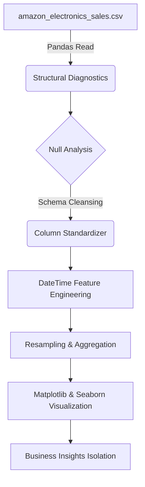

# A. Amazon Electronics Store Analytics Pipeline

An end-to-end data diagnostics, processing, and exploratory data analysis (EDA) pipeline built in Python. This project evaluates a production dataset containing **50,000 corporate transaction records** across **26 operational variables** to isolate macroeconomic cycles, calculate elasticity, identify major revenue drivers, and map margin erosion.

---

## 📊 Pipeline Architecture & Workflow



---

## 🛠️ Technical Features & Engineering Highlights

* **Automated Schema Sanitization:** Eliminates string spacing and case-sensitivity vulnerabilities by programmatically normalising raw headers.
* **Time-Series Financial Resampling:** Parses raw transaction strings into active DateTime indices, downsampling transaction velocity into month-end (`ME`) and quarter-end (`QE`) financial horizons.
* **Correlative Dependency Matrixing:** Implements Pearson correlation mapping to find explicit dependencies between sales volume, logistics overhead, and profit erosion.
* **Bivariate Density Mapping:** Utilizes high-density Hexbin maps to isolate discrete purchase frequency concentrations against promotional markdown bounds.

---

## 💻 Dependencies & Setup

This pipeline is optimized for Python 3.10+ and relies on standard data science libraries:

```bash
pip install pandas matplotlib seaborn numpy ipykernel
```

To run the pipeline, clone the repository, ensure `amazon_electronics_sales.csv` is in the same directory, and launch the notebook:

```bash
git clone https://github.com
cd amazon-electronics-analytics
jupyter notebook
```

---

## 📂 Code Module Breakdown

### 1. Structural Diagnostics & Schema Sanitization
```python
def df_info(store_df):
    print(store_df.info())

def check_nulls(store_df):
    print(store_df.isnull().any())

def standardize_cols(store_df):
    store_df.columns = store_df.columns.str.lower().str.replace(' ','_')
```
* **Purpose:** Runs a defensive check across data vectors to flag structural missingness (such as `postal_code` null gaps) before programmatically sanitizing messy columns into standard snake_case tokens.

### 2. Chronological Sales Resampling
```python
def monthly_quaterly_sales(store_df):
    store_df["order_date"] = pd.to_datetime(store_df["order_date"], dayfirst=True)
    df_temp = store_df.set_index("order_date")
    monthly_sales = df_temp["sales"].resample("ME").sum()
    quarterly_sales = df_temp["sales"].resample("QE").sum()
    # Lineplot trend visualizer...
```
* **Purpose:** Dynamically changes data resolution into standard fiscal reporting buckets to track market spending ebbs and flows over time.

### 3. Pearson Correlation Heatmap
```python
def df_corr(store_df):
    corr_df = store_df.corr(numeric_only=True)
    # Seaborn coolwarm mapping matrix...
```
* **Purpose:** Calculates mathematical dependencies between variables to uncover hidden margin drivers and operational cost behaviors.

### 4. Bivariate Concentration Hex Map
```python
def df_hex(store_df):
    hb = ax.hexbin(store_df["discount"], store_df["quantity"], gridsize=15, cmap="YlOrRd")
    # Colorbar density scaler...
```
* **Purpose:** Aggregates thousands of overlapping data points into distinct, shaded cells to reveal exact customer demand clusters under different pricing models.

---

## 📈 Deep-Dive Analytical Insights

### 1. Macro Sales Volatility & Cash Management
* **Cyclical Shocks:** The store is highly susceptible to cyclical demand shocks rather than stable month-over-month expansion. Gross monthly transaction volumes surge around the middle of each year (peaking near **\$540,000**), immediately followed by deep operational contractions dropping down to floors near **\$440,000** in the opening quarters.
* **Business Takeaway:** Cash flow configurations must be managed conservatively during peak mid-year windfalls to safely cushion the predictable, sharp spending pullbacks that follow.

### 2. High-Ticket Pareto Drivers
* **Enterprise Dependencies:** A tiny fraction of enterprise business hardware accounts for a massive proportion of global top-line numbers. The **Canon imageCLASS Copier** and **Cisco Smart Office Phone** are core revenue anchors, generating over **\$4.0 million** each. Premium office furniture occupies the secondary tier around **\$2.4 million**, while smartphones baseline at **\$2.0 million**.
* **Business Takeaway:** Procurement teams must safeguard relationships with these hardware suppliers to ensure uninterrupted inventory flow and prevent critical stockouts.

### 3. Linear Correlation Matrix & Profit Leaks
* **Logistics Overhead:** An absolute correlation coefficient of **1.00** connects gross sales directly to shipping costs, proving that distribution overhead scales identically beside revenue. 
* **Margin Drain:** A heavy negative correlation of **-0.52** links promotional discounts with net profits, proving mathematically that markdown strategies act as the single largest drag on corporate value.
* **Business Takeaway:** Establish strict promotional markdown caps to stop the **-0.52 profit leak**. Furthermore, since customer age attributes show an exact **0.00 correlation** with sales metrics, avoid dividing marketing budgets by generation; buying scale remains completely uniform across demographics.

### 4. Price Elasticity via Density Mapping
* **Volume Inelasticity:** The hexagonal concentration map reveals that the highest purchase frequency (over **6,000+ orders**) occurs exclusively at a **0.0 discount rate** across all quantity tiers (1 through 5). Lowering prices to 10%, 20%, 40%, or 60% fails to move buyers into higher-volume groupings.
* **Business Takeaway:** Widespread discounting is highly inefficient. Customers purchase identical quantities regardless of price incentives, meaning markdowns only degrade margins without generating a meaningful lift in sales volume.

# B. Customer Segmentation & Analytics Pipeline (RFM + CLV + K-Means)

An end-to-end data science and business intelligence pipeline engineered in Python to ingest raw transactional sales logs, perform data cleaning, extract high-value customer health features (RFM metrics), calculate Customer Lifetime Value (CLV), and systematically categorize users into action-oriented value tiers using K-Means clustering.

## Pipeline Architecture & Features

This system automatically translates tabular, raw transaction-level databases into strategic marketing layers using the following modular functions:

1. **Ingestion & Integrity Assessment (`load_inspect`)**: Checks dimensions, scans for structural issues, null flags, and duplicated entry records.
2. **Data Type Harmonization (`df_clean`)**: Safely casts transactional timestamps and coerces monetary fields into numerical floats.
3. **Null Imputation Layer (`handle_nulls`)**: Dynamically isolates and fills gaps—using non-numeric categorical modes or statistical numeric averages.
4. **Column Standardization (`standardize_cols`)**: Sanitizes fields into a globally accessible `snake_case` taxonomy.
5. **Feature Engineering Engine (`rfm_clv`)**:
   * **Recency (R)**: Days elapsed between the user's latest transaction and the historical data snapshot window.
   * **Frequency (F)**: Aggregate unique volume of specific transaction occurrences.
   * **Monetary (M)**: Aggregate absolute monetary spend profile across time.
   * **Churn Diagnostics**: Automatically flags churned states against defined threshold horizons (e.g., 90 days) and builds cohort metrics.
   * **CLV Mapping**: Infers explicit Customer Lifetime Value based on dynamic Average Purchase Value (APV) scaling.
6. **Machine Learning Normalization & Cluster Optimization (`apply_customer_segmentation`)**: Runs mathematical standard scaling (`StandardScaler`), builds a Within-Cluster Sum of Squares (WCSS) iteration loop, generates a dynamic **Elbow Plot**, and maps optimal user-tier index keys back to customer entities.
7. **Production Business Reporting (`execute_cluster_analytics_report`)**: Renders bivariate cluster boundary scatter subplots, customer account volume counts, and yields a natural language processing mapping framework to output data-driven strategic marketing recommendations.

---

## Repository File Layout

```text
├── data/
│   └── AfroSense Sales Data.xlsx     # Target raw transactional ledger file
├── customer_analytics_pipeline.ipynb # Core algorithmic notebook workflow
└── README.md                         # Pipeline documentation and architecture
```

---

## Technical Prerequisites & Environment

Ensure you have a modern Python 3.x distribution environment installed. The pipeline heavily utilizes the following analytics libraries:

```bash
pip install numpy pandas matplotlib seaborn scikit-learn openpyxl
```

---

## How to Execute the Pipeline

Open `customer_analytics_pipeline.ipynb` inside your target notebook server environment or IDE. To run the structural execution pattern programmatically, follow this functional order:

```python
import pandas as pd
# Import functions defined within the notebook cells...

# 1. Load data
_file = "data/AfroSense Sales Data.xlsx"
raw_df = pd.read_excel(_file)

# 2. Run sequential cleaning and transformation
inspected_df   = load_inspect(raw_df)
standardized   = standardize_cols(inspected_df)
cleaned        = df_clean(standardized)
null_cleansed  = handle_nulls(cleaned)

# 3. Structural feature extraction (RFM matrix + CLV modeling)
customer_profiles = rfm_clv(null_cleansed)

# 4. Fit K-Means Clustering model (Runs Elbow Plot & Labels Datasets)
segmented_df = apply_customer_segmentation(customer_profiles)

# 5. Renders comprehensive scatter/bar analytics plots & strategic summaries
execute_cluster_analytics_report(segmented_df)
```

---

## Visualizations & Automated Reporting Outputs

### 1. Optimal Cluster (K Parameter) Selection
The pipeline renders a diagnostic **Elbow Method Curve** using calculated WCSS metrics up to K=10. It superimposes a typical mathematical elbow benchmark at K=3 to help you decide how many customer tiers are ideal for your dataset.

### 2. Segment Splitting Evaluation Plots
Generates multi-pane internal visual comparisons mapping **Recency vs. Monetary** boundaries and **Frequency vs. Monetary** boundaries to prove variance separation between customer types.

### 3. Automatically Generated Marketing Frameworks
Based on data traits processed during execution, the reporting engine classifies and prints customized strategy briefs for each value tier:
* 🏆 **Core Champions / VIP Accounts**: Characterized by high transaction frequency and strong total spend. *Recommendation*: Roll out loyalty club benefits, exclusive product pre-access, and focus on premium upsells over heavy discounts.
* 🚀 **Promising New / Mid-Tier Accounts**: High-potential recent buyers. *Recommendation*: Trigger product education welcome loops and deliver second-purchase bundle rewards to systematically drive transaction frequency.
* ⚠️ **Churn Risk Inactive Cohort**: Customers who haven't purchased in a long time with flagging system engagement. *Recommendation*: Deploy time-sensitive recovery coupon codes via automated win-back funnels and trigger survey diagnostics to address points of friction.
